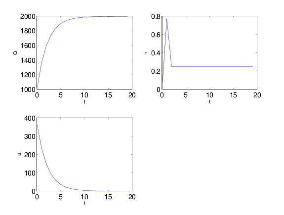
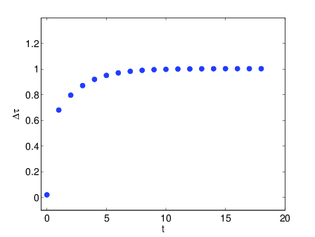
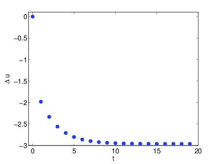

Introduction
============

This lecture describes *history-dependent public policies* and some of their representations

We study these objects in the context of a model in which a benevolent tax authority is forced to raise a prescribed present value of revenues by imposing a distorting flat rate tax on the output of a competitive representative firm that faces costs of adjusting its output. 

That the firm lives within a competitive equilibrium imposes restrictions on the tax authority. [1]_

We compare two timing protocols.

In the first, an infinitely lived benevolent tax authority solves a Ramsey problem. 

This means that the authority chooses a sequence of tax rates once-and-for-all at time :math:`0`. 

In the second timing protocol, there is a sequence of tax authorities, each choosing only a time :math:`t` tax rate. 

Under both timing protocols, optimal tax policies are *history-dependent*

But  history dependence captures  different economic forces across the two timing protocols.

In the first timing protocol, history dependence expresses the *time-inconsistency of the Ramsey plan*

In the second timing protocol, history dependence reflects the unfolding of constraints that assure that a time :math:`t` government wants to confirm the representative firm's expectations about government actions. 

We  describe recursive representations of history-dependent tax policies under both timing protocols.

The first timing protocol  models a policy maker who can be said to  'commit'. 

To obtain a recursive representation of a Ramsey policy, we  compare two methods. 

We  first apply a method proposed  by :cite:`KP1980` that uses a promised marginal utility to augment authentic state variables. 

We then apply a closely related method of :cite:`Miller_Salmon_1`, :cite:`PCL1986`, and :cite:`Backus_Driffill`. 

   * This method uses a 'co-state on a co-state' variable to augment the authentic state variables.
   
After applying both methods, we describe links between them and confirm that they recover the same Ramsey plan.

Turning to the second timing protocol in which the tax rate is chosen sequentially, we use the notion of a sustainable plan proposed by :cite:`Chari_Kehoe_1990`, also referred to as a credible public policy by :cite:`Stokey_1989`. 

A key idea here is that history-dependent policies can be arranged so that, when regarded as a representative firm's forecasting functions, they confront policy makers with  incentives  to confirm them. 

We follow :cite:`Chang1998` in expressing such   history-dependent plans recursively. 

Credibility considerations contribute an additional auxiliary state variable (above and beyond the auxiliary state variable  appearing in the first timing protocol).

     * This new state variable is a promised value to the planner.  
     
     * It expresses how decisions must unfold to give the government the incentive to confirm private sector expectations when the government chooses sequentially.

.. note:: 
      We occasionally hear confusions about the consequences of our two timing protocols and about recursive representations of government policies under them.
      It is erroneous to regard a recursive representation of the Ramsey plan as in any way 'solving' a time-inconsistency problem.
      On the contrary, the evolution of the auxiliary state variable that augments the authentic ones under our first timing protocol ought to be viewed as
      *expressing* the time-inconsistency of a Ramsey plan.  Despite that, in literatures about practical monetary policy one sometimes hears interpretations that sell
      Ramsey plans in settings where our sequential timing protocol more accurately characterizes decision making.
      Please beware of discussions of credibility if you don't see recursive representations of policies with the complete list of state variables appearing
      in the :cite:`Chang1998` -like analysis that we present XXXXXX :ref:`sec:credible` below.

Competitive equilibrium
=======================

A representative competitive firm sells output :math:`q_t` for price :math:`p_t`, where market-wide output is :math:`Q_t`.

The market as a whole faces a downward sloping inverse demand function

.. math::
  p_t = A_0 - A_1 Q_t, \quad A_0 >0, A_1 >0
  :label: ES_1

The representative firm has given initial condition :math:`q_0`, endures quadratic adjustment costs :math:`\frac{d}{2} (q_{t+1} - q_t)^2`, and pays a flat rate tax :math:`\tau_t` per unit of output. 

The firm faces what it regards as exogenous sequences :math:`\{p_t, \tau_t\}_{t=0}^\infty` and chooses :math:`\{q_{t+1}\}_{t=0}^\infty` to maximize

.. math::
  \sum_{t=0}^\infty \beta^t \bigl\{ p_t q_t - \frac{d}{2}(q_{t+1} - q_t)^2 - \tau_t q_t \bigr\}
  :label: ES_2

Let :math:`u_t = q_{t+1} - q_t` be the firm's 'control' variable at time :math:`t`.

First-order conditions for the firm's problem are

.. math::
   u_t = \frac{\beta}{d} p_{t+1} + \beta u_{t+1} - \frac{\beta}{d} \tau_{t+1}
   :label: ES_3

for :math:`t \geq 0`.

**Notation:** For any scalar :math:`x_t`, let :math:`\vec x = \{x_t\}_{t=0}^\infty`.

To compute a competitive equilibrium, it is appropriate to take , eliminate :math:`p_t` in favor of :math:`Q_t` by using , and then set :math:`q_t = Q_t`, thereby making the *representative firm be representative* [2]_ 

We arrive at

.. math::
   u_t = \frac{\beta}{d} \left[ A_0 - A_1 Q_{t+1} \right] + \beta u_{t+1} - \frac{\beta}{d} \tau_{t+1}
   :label: ES_4

We also have

.. math::
   Q_{t+1} = Q_t + u_t .
   :label: ES_5

Equations :eq:`ES_1`,  :eq:`ES_4`, and :eq:`ES_5` summarize competitive equilibrium sequences for :math:`(\vec p, \vec Q, \vec u)` as functions of the path :math:`\{\tau_{t+1}\}_{t=0}^\infty` for the flat rate distorting tax :math:`\tau`.

**Definition** Given a tax sequence :math:`\{\tau_{t+1}\}_{t=0}^\infty`, a competitive equilibrium is a price sequence :math:`\{p_t\}_{t=0}^\infty` and an output sequence :math:`\{Q_t\}_{t=0}^\infty` that satisfy :eq:`ES_1`,  :eq:`ES_4`, and :eq:`ES_5`.

.. TODO: Should we try to number definitions? I couldn't find a way for sphinx to do this out of the box

.. TODO: Can't figure out how to label definitions... Moving on for now and we can come back to it later if we need to.

**Definition** For any sequence :math:`\vec x = \{x_t\}_{t=0}^\infty`, :math:`\vec x_1 \equiv \{x_t\}_{t=1}^\infty` is called a *continuation* sequence or simply a *continuation*.

**Remark** A competitive equilibrium consists of a first period value :math:`u_0 = Q_1-Q_0` and a continuation competitive equilibrium with initial condition :math:`Q_1`. A continuation of a competitive equilibrium is a competitive equilibrium.

Following the lead of :cite:`Chang1998`, we shall make extensive use of the following property:

**Remark** A continuation :math:`\vec \tau_1 = \{\tau_{t+1}\}_{t=1}^\infty` of a tax policy :math:`\vec \tau` influences :math:`u_0` via entirely through its impact on :math:`u_1`. A continuation competitive equilibrium can be indexed by a :math:`u_1` that satisfies .

**Definition** With some abuse of language, in the spirit of and , we shall use :math:`u_{t+1}` to describe what we shall call a 'promised marginal value' that a competitive equilibrium offers to a representative firm.

**Remark** We could instead, perhaps with more accuracy, define a promised marginal value as :math:`\beta (A_0 - A_1 Q_{t+1} ) - \beta \tau_{t+1} + \frac{u_{t+1}}{\beta}`, since this is the object to which the firm's first order condition instructs it to equate to the marginal cost :math:`d u_t` of :math:`u_t = q_{t+1} - q_t`. [3]_ But given :math:`(u_t, Q_t)`, the representative firm knows :math:`(Q_{t+1},\tau_{t+1})`, so it is adequate to take :math:`u_{t+1}` as the intermediate variable that summarizes how :math:`\vec \tau_{t+1}` affects the firm's choice of :math:`u_t`.

**Definition** Define a history :math:`Q^t = [Q_0, \ldots, Q_t]`. A history-dependent tax policy is a sequence of functions :math:`\{\sigma_t\}_{t=0}^\infty` with time :math:`t` component :math:`\sigma_t` mapping :math:`Q^t` into a choice of :math:`\tau_{t+1}`.

Below we shall study history-dependent tax policies that either (a) solve a Ramsey plan, or (b) are credible. We shall describe recursive representations of both types of history-dependent policies.

.. NOTE: I did not number definitions or remarks in this section

Ramsey problem
==============

The planner's objective is cast in terms of consumer surplus net of the firm's adjustment costs. Consumer surplus is:

.. math::
   \int_0^Q [ A_0 - A_1 x] dx = A_0 Q - \frac{A_1}{2} Q^2

so the planner's one-period return function is

.. math::
    A_0 Q_t - \frac{A_1}{2} Q_t^2 - \frac{d}{2} u_t^2
   :label: ES_7

At time :math:`0`, a Ramsey planner faces the intertemporal budget constraint

.. math::
   \sum_{t=1}^\infty \beta^t \tau_t Q_t = G_0 .
   :label: ES_6

Note that :eq:`ES_6` precludes taxation of initial output :math:`Q_0`.

**Definition** The Ramsey problem is to choose a tax sequence :math:`\vec \tau` and a competitive equilibrium outcome :math:`(\vec Q, \vec u)` that maximize

.. math::
  \sum_{t=0}^\infty \beta^t \left[ A_0 Q_t - \frac{A_1}{2}Q_t^2 - \frac{d}{2} u_t^2 \right]
  :label: ES_Lagrange0

subject to :eq:`ES_6`.

**Definition** Ramsey timing protocol.

#. At time :math:`0`, knowing :math:`(Q_0, G_0)`, the Ramsey planner chooses :math:`\{\tau_{t+1}\}_{t=0}^\infty`.

#. Given :math:`\bigl(Q_0, \{\tau_{t+1}\}_{t=0}^\infty\bigr)`, a competitive equilibrium outcome :math:`\{u_t, Q_{t+1}\}_{t=0}^\infty` emerges (see definition of cometitive equilibrium).

**Remark** In bringing out the timing protocol associated with a Ramsey plan, we run head on to a set of issues analyzed by Basetto (2005)XXXX. This is because in definition of Ramsey Protocol of the Ramsey timing protocol, we have not completely described conceivable actions by the government and firms as time unfolds. For example, we are silent about how the government would respond if firms, for some unspecified reason, were to choose to deviate from the competitive equilibrium associated with the Ramsey plan, thereby possibly violating budget balance . Our definition of a Ramsey plan says nothing about how the government would respond. This is an example of the issues raised by Basse, who identifies a class of government policy problems whose proper formulation requires supplying a complete and coherent description of all actors' behavior across all possible histories. Implicitly, we are assuming that a more complete description of a government strategy than we have included could be specified that (a) agrees with ours along the Ramsey outcome, and (b) suffices uniquely to implement the Ramsey plan by deterring firms from taking actions that deviate from the Ramsey outcome path.

.. NOTE: I did not number definitions or remarks in this section

Computing a Ramsey plan
-----------------------

The planner chooses :math:`\{u_t\}_{t=0}^\infty, \{\tau_t\}_{t=1}^\infty` to maximize :eq:`ES_Lagrange0` subject to :eq:`ES_4`, :eq:`ES_5`, and :eq:`ES_6`. To formulate this problem as a Lagrangian, attach a Lagrange multiplier :math:`\mu` to the budget constraint :eq:`ES_6`. Then the planner chooses :math:`\{u_t\}_{t=0}^\infty, \{\tau_t\}_{t=1}^\infty` to maximize and the Lagrange multiplier :math:`\mu` to minimize

.. math::
  \sum_{t=0}^\infty \beta^t \left[ A_0 Q_t - \frac{A_1}{2}Q_t^2 - \frac{d}{2} u_t^2 \right] +\mu\left[\sum_{t=0}^\infty\beta^t\tau_t Q_t -G_0 - \tau_0 Q_0\right]
  :label: ES_Lagrange1

subject to and :eq:`ES_4` and :eq:`ES_5`.

.. _sec:Lagrange_multipler:

Implementability multiplier approach
=====================================

The Ramsey problem is a special case of the linear quadratic dynamic Stackelberg problem analyzed in XXXXXX.

The idea is to construct a recursive representation of a Ramsey plan by taking as state variables Lagrange multipliers on implementability constraints that require the Ramsey planner to choose among competitive equilibrium allocations. 

The motion through time of these Lagrange multipliers become components of a recursive representation of a history-dependent plan for taxes.

For us, the key implementability conditions are for :math:`t \geq 0`.

Holding fixed :math:`\mu` and :math:`G_0`, the Lagrangian for the planning problem can be abbreviated as

.. math::
  \max_{\{u_t\},\{\tau_{t+1}\}} \sum_{t=0}^\infty \beta^t\left[A_0 Q_t-\frac {A_1}2 Q_t^2-\frac d2 u_t^2+\mu\tau_tQ_t\right]

Define

.. math::
  y_t = \left(\begin{matrix} z_t\\ u_t\end{matrix}\right) = \left(\begin{matrix} 1\\ Q_t\\ \tau_t \ u_t\end{matrix}\right)

\ where :math:`z_t = \left(\begin{matrix} 1 \ Q_t\\ \tau_t\end{matrix}\right)` are genuine state variables and :math:`u_t` is a jump variable. 

We include :math:`\tau_t` as a state variable for bookkeeping purposes: it helps to map the problem into a linear regulator problem with no cross products between states and controls. 

However, it will be a redundant state variable in the sense that the optimal tax :math:`\tau_{t+1}` will not depend on :math:`\tau_t`. 

The government chooses :math:`\tau_{t+1}` at time :math:`t` as a function of the time :math:`t` state. 

Thus, we can rewrite the Ramsey problem as

.. math::
  \max_{\{y_t\},\{\tau_{t+1}\}} -\sum_{t=0}^\infty \beta^t y_t' Ry_t
  :label: ES_10

subject to :math:`z_0` given and the law of motion

.. math::
  \left(\begin{matrix} z_{t+1}\\ u_{t+1}\end{matrix}\right) = A\left(\begin{matrix} z_t\\ u_t\end{matrix}\right)+B\tau_{t+1}
  :label: ES_11

where

.. math::
   R = \left(\begin{matrix} 0 &-\frac{A_0}{2} & 0 & 0 \\-\frac{A_0}{2} & \frac{A_1}{2} & \frac {-\mu}{2} & 0\\ 0 & \frac{-\mu}{2} & 0 & 0\\ 0 & 0 & 0 & \frac{d}{2} \end{matrix}\right),
   \: A = \left(\begin{matrix}1 & 0 & 0 & 0\\ 0 & 1 & 0 & 1\\ 0 & 0 & 0 & 0 \\-\frac{A_0}{d} & \frac{A_1}{d} & 0 & \frac{A_1}{d} + \frac{1}{\beta} \end{matrix}\right) \text{,  and  }B =\left(\begin{matrix} 0 \\ 0 \\ 1 \\ \frac{1}{d} \end{matrix}\right)

Because this problem falls within the framework, we can proceed as follows.

Letting :math:`\lambda_t` be a vector of Lagrangian multipliers on the transition laws summarized in equation XXXXX, it follows that :math:`\lambda_t = P y_t`, where :math:`P` solves the Riccati equation

.. math:: P = R+\beta A' PA-\beta^2A'PB(\beta B'PB)^{-1}B'PA

\ and :math:`\tau_{t+1} = -F y_t`, where

.. math:: F = \beta(\beta B'PB)^{-1}B'PA .

\ This we can rewrite as

.. math:: \left(\begin{matrix}\lambda_{zt}\ \lambda_{ut}\end{matrix}\right)=\left(\begin{matrix} P_{11}&P_{12}\\P_{21}&P_{22}\end{matrix}\right)\left(\begin{matrix} z_t \\u_t\end{matrix}\right) .

\ Solve for :math:`u_t` to get

.. math:: u_t = -P_{22}^{-1}P_{21}z_t+P_{22}^{-1}\lambda_{ut},

where now the multiplier :math:`\lambda_{ut}` becomes our authentic state variable, one that measures the costs of confirming the public's prior expectations about time :math:`t` government actions. 

Then the complete state at time t becomes :math:`\left(\begin{matrix} z_t \ \lambda_{ut}\end{matrix}\right)`. Thus,

.. math:: y_t = \left(\begin{matrix} z_t\\ u_t\end{matrix}\right) = \left(\begin{matrix} I & 0\\ -P_{22}^{-1}P_{21}&P_{22}^{-1}\end{matrix}\right)\left(\begin{matrix} z_t \ \lambda_{ut}\end{matrix}\right)

\ so

.. math:: \tau_{t+1} = -F\left(\begin{matrix} I & 0\\ -P_{22}^{-1}P_{21}&P_{22}^{-1}\end{matrix}\right)\left(\begin{matrix} z_t \ \lambda_{ut}\end{matrix}\right).

\ The evolution of the state is

.. math:: \left(\begin{matrix} z_{t+1}\ \ lambda_{ut+1}\end{matrix}\right) = \left(\begin{matrix} I & 0 \ P_{21}&P_{22}\end{matrix}\right)(A-BF)\left(\begin{matrix} I & 0\\ -P_{22}^{-1}P_{21}&P_{22}^{-1}\end{matrix}\right)\left(\begin{matrix} z_t \ \lambda_{ut}\end{matrix}\right)

\ with initial state

.. math::
  \left(\begin{matrix} z_0 \ \lambda_{u0}\end{matrix}\right) = \left(\begin{matrix} 1\\ Q_0 \ \tau_0 \ 0\end{matrix}\right).
  :label: ES_initial_lambda

Equation :eq:`ES_initial_lambda` incorporates the finding that the Ramsey planner finds it optimal to set :math:`\lambda_{u0}` to zero.

Kydland-Prescott (1980) approach
================================

:cite:`KP1980` or :cite:`Chang1998` or would formulate our Ramsey problem in terms of the following Bellman equation:

.. math:: v(Q_t,\tau_t,u_t) = \max_{\tau_{t+1}} \left\{A_0 Q_t-\frac {A_1}2 Q_t^2-\frac d2 u_t^2+\mu\tau_tQ_t + \beta v(Q_{t+1},\tau_{t+1},u_{t+1}) \right\}

where the maximization is subject to the constraints

.. math:: Q_{t+1} = Q_t+u_t

and

.. math:: u_{t+1}  =-\frac{A_0}d+\frac{A_1}d Q_t+\left(\frac{A_1}d+\frac1\beta\right)u_t+\frac1d \tau_{t+1}.

We now regard :math:`u_t` as a state. It plays the role of a promised marginal utility in the :cite:`KP1980` framework.

Define the state vector to be

.. math::
  y_t = \left(\begin{matrix}1\cr Q_t\cr \tau_t\cr u_t\end{matrix}\right) = \left(\begin{matrix} z_t\cr u_t\end{matrix}\right),

where :math:`z_t = \left(\begin{matrix} 1\cr Q_t\cr \tau_t\end{matrix}\right)` are authentic state variables and :math:`u_t` is a variable whose time :math:`0` value is a 'jump' variable but whose values for dates :math:`t \geq 1` will become state variables that encode history dependence in the Ramsey plan. 

Write a dynamic programming problem in the style of Kydland and Prescott XXXXX as

.. math::
  v(y_t) = \max_{\tau_{t+1}} \left\{ -y_t'Ry_t+\beta v(y_{t+1}) \right\} ,
  :label: ES_KP

where the maximization is subject to the constraint

.. math:: y_{t+1} = Ay_t+B\tau_{t+1},

and where

.. math::
   R = \left(\begin{matrix} 0 & -\frac {A_0}2 & 0 & 0 \ -\frac{A_0}2 & \frac{A_1}2 & \frac {-\mu}{2}&0\\ 0 & \frac{-\mu}{2}&0 & 0 \\ 0 & 0 & 0&\frac d2\end{matrix}\right),
   \: A = \left(\begin{matrix}1 & 0 & 0 & 0 \\ 0 & 1 & 0 & 1\\ 0 & 0 & 0 & 0 \ -\frac{A_0}d & \frac{A_1}d & 0 & \frac{A_1}d+\frac1\beta\end{matrix}\right)\text{,  and  }B =\left(\begin{matrix} 0 \ 0 \\ 1 \ \frac1d\end{matrix}\right).

Functional equation :eq:`ES_KP` has solution

.. math:: v(y_t) = -y_t'Py_t

where :math:`P` solves the algebraic matrix Riccati equation

.. math:: P = R+A'PA-A'PB(B'PB)^{-1}B'PA

and the optimal policy function is given by

.. math::
  \tau_{t+1} = -F y_t,
  :label: ES_optF

where

.. math::
  F = \beta(\beta B'PB)^{-1}B'PA = (B'PB)^{-1}B'PA .
  :label: ES_F_formula

Note that since as the formulas for :math:`A`,\ :math:`B`, and :math:`R` are identical, it follows that :math:`F` and :math:`P` are the same as in the Lagrangian multiplier approach of section :ref:`sec:Lagrange_multipler`. 

The optimal choice of :math:`u_0` satisfies

.. math:: \frac{\partial v}{\partial u_0} =0.

\ If we partition :math:`P` as

.. math::
  P = \left(\begin{matrix} P_{11}&P_{12}\\ P_{21}&P_{22}\end{matrix}\right)

then we have

.. math::
  0=\frac{\partial}{\partial u_0}\left(z_0'P_{11}z_0+z_0'P_{12}u_0+u_0'P_{21}z_0 +u_0' P_{22} u_0\right)=P_{12}'z_0+P_{21}u_0+2P_{22}u_0

which implies

.. math::
  u_0 = -P_{22}^{-1}P_{21}z_0 .
  :label: ES_u0

Thus, the Ramsey plan is

.. math::
  \tau_{t+1} =-F\left(\begin{matrix} z_t\\ u_t\end{matrix}\right)\text{  and  }\left(\begin{matrix} z_{t+1}\\ u_{t+1}\end{matrix}\right) = (A-BF)\left(\begin{matrix} z_t\\ u_t\end{matrix}\right)

with initial state :math:`\left(\begin{matrix} z_0\\ -P_{22}^{-1}P_{21}z_0\end{matrix}\right)`.

Comparison of the two approaches
--------------------------------

We can compare the outcome from the Kydland-Prescott approach to the outcome of the Lagrangian multiplier on the implementability constraint approach of section :ref:`sec:Lagrange_multipler`.

Using the formula

.. math::
  \left(\begin{matrix} z_t\\ u_t\end{matrix}\right) = \left(\begin{matrix} I & 0\\ -P_{22}^{-1}P_{21}&P_{22}^{-1}\end{matrix}\right)\left(\begin{matrix} z_t \ \lambda_{ut}\end{matrix}\right)

and applying it to the evolution of the state

.. math::
  \left(\begin{matrix} z_{t+1}\ \ lambda_{ut+1}\end{matrix}\right) = \left(\begin{matrix} I & 0 \ P_{21}&P_{22}\end{matrix}\right)(A-BF)\left(\begin{matrix} I & 0\\ -P_{22}^{-1}P_{21}&P_{22}^{-1}\end{matrix}\right)\left(\begin{matrix} z_t \ \lambda_{ut}\end{matrix}\right),

\ we get

.. math::
  \left(\begin{matrix} z_{t+1}\\ u_{t+1}\end{matrix}\right) = (A-BF)\left(\begin{matrix} z_t\\ u_t\end{matrix}\right)
  :label: ES_recursive_rep_u

or

.. math::
  y_{t+1} = A_F y_t ,
  :label: ES_lomy

where :math:`A_F \equiv A- BF`.

Then using the initial state value :math:`\lambda_{u,0}=0`, we obtain

.. math::
  \left(\begin{matrix} z_0\\ u_0\end{matrix}\right) = \left(\begin{matrix} z_0\\ -P_{22}^{-1}P_{21}z_0\end{matrix}\right).
  :label: ES_24aa

This is identical to the initial state delivered by the Kydland-Prescott approach.

Recursive representation
========================

An outcome of the preceding results is that the Ramsey plan can be represented recursively as the choice of an initial marginal utility (or rate of growth of output) according to a function

.. math::
  u_0 = \upsilon(Q_0|\mu)
  :label: ES_24

that obeys and the following updating equations for :math:`t\geq 0`:

.. math::
  \tau_{t+1} & = & \tau(Q_t, u_t|\mu)
  :label: ES_25

.. math::
  Q_{t+1} & =  & Q_t + u_t
  :label: ES_26

.. math::
  u_{t+1} & = & u(Q_t, u_t|\mu)
  :label: ES_27

We have conditioned the functions :math:`\upsilon`, :math:`\tau`, and :math:`u` by :math:`\mu` to emphasize how the dependence of :math:`F` on :math:`G_0` appears indirectly through the Lagrange multiplier :math:`\mu`. We'll discuss how to compute :math:`\mu` in section :ref:`sec:computing_mu`, but first want to consider the following numerical example.

Example
-------

We computed the Ramsey plan for the following parameter values: :math:`[A_0, A_1, d, \beta, Q_0] = [100, .05, .2, .95, 100]`. Figure :ref:`fig:ES_plot_1` reports the Ramsey plan for :math:`\tau` and the Ramsey outcome for :math:`(Q_t,u_t)` for :math:`t=0, \ldots, 20`. [4]_ 

The optimal decision rule is [5]_

.. math::
  \tau_{t+1} = -248.0624 - 0.1242 Q_t - 0.3347 u_t
  :label: ES_tax_rule

Notice how the Ramsey plan calls for a high tax at :math:`t=1` followed by a perpetual stream of lower taxes. 

Taxing heavily at first, less later sets up a time-inconsistency problem that we'll characterize formally after first discussing how to compute :math:`\mu`.

.. TODO: Pick up here!

.. _fig:ES_plot_1:

  Figure 1

  Ramsey plan and Ramsey outcome. From upper left to right, first panel: :math:`Q_t`; second panel, :math:`\tau_t`, third panel :math:`u_t = Q_{t+1} - Q_t`.

.. _sec:computing_mu:

Computing :math:`\mu`
=====================

Define the selector vectors :math:`e_\tau = \left[\begin{matrix} 0 & 0 & 1 & 0 \end{matrix}\right]'` and :math:`e_Q = \left[\begin{matrix} 0 & 1 & 0 & 0 \end{matrix} \right]'`. Then express :math:`\tau_t = e_\tau' y_t` and :math:`Q_t = e_Q' y_t`. Evidently, tax revenues :math:`Q_t \tau_t = y_t' e_Q e_\tau' y_t = y_t' S y_t` where :math:`S \equiv e_Q e_\tau'`. We want to compute

.. math::
  T_0 = \sum_{t=1}^\infty \beta^t \tau_t Q_t  = \tau_1 Q_1 + \beta T_1

where :math:`T_1 = \sum_{t=2}^\infty \beta^{t-1} Q_t \tau_t .` The present values :math:`T_0` and :math:`T_1` are connected by

.. math::
  T_0 = \beta y_0' A_F' S A_F y_0 + \beta T_1

Guess a solution that takes the form :math:`T_t = y_t' \Omega y_t` 

Then find an :math:`\Omega` that satisfies

.. math::
  \Omega = \beta A_F' S A_F + \beta A_F' \Omega A_F
  :label: ES_Lyapunov

Equation :eq:`ES_Lyapunov` is a discrete Lyapunov equation that can be solved for :math:`\Omega` using the Matlab program ``dlyap`` or ``doublej2``.
*XXXXX replace the preceding by appropriate python programs when available*

The matrix :math:`F` and therefore the matrix :math:`A_F = A-BF` depend on :math:`\mu`. To find a :math:`\mu` that guarantees that

.. math::
   T_0 = G_0
   :label: ES_budget1

we proceed as follows:

#. Guess an initial :math:`\mu`, compute a tentative Ramsey plan and the implied :math:`T_0 = y_0' \Omega(\mu) y_0`.

#. If :math:`T_0 > G_0`, lower :math:`\mu`; if :math:`T_0 < \mu`, raise :math:`\mu`.

#. Continue iterating on step 3 until :math:`T_0 = G_0`.

Time inconsistency
==================

Recall that the Ramsey planner chooses :math:`\{u_t\}_{t=0}^\infty, \{\tau_t\}_{t=1}^\infty` to maximize

.. math::
  \sum_{t=0}^\infty \beta^t \left[ A_0 Q_t - \frac{A_1}{2}Q_t^2 - \frac{d}{2} u_t^2 \right]

:eq:`ES_4`, :eq:`ES_5`, and :eq:`ES_6`.

We express the outcome that  a Ramsey plan is time-inconsistent the following way

**Proposition** A continuation of a Ramsey plan is not a Ramsey plan.

.. NOTE: this proposition is not numbered

Let

.. math::
   w(Q_0,u_0|\mu_0)= \sum_{t=0}^\infty \beta^t \left[ A_0 Q_t - \frac{A_1}{2}Q_t^2 - \frac{d}{2} u_t^2 \right]
   :label: ES_Ramsey_value

where :math:`\{Q_t,u_t\}_{t=0}^\infty` are evaluated under the Ramsey plan whose recursive representation is given by :eq:`ES_25`, :eq:`ES_26`, :eq:`ES_27` and where :math:`\mu_0` is the value of the Lagrange multiplier that assures budget balance, computed as described in section :ref:`sec:computing_mu`. 

Evidently, these continuation values satisfy the recursion

.. math::
  w(Q_t,u_t|\mu_0) = A_0 Q_{t} - \frac{A_1}{2} Q_{t}^2 - \frac{d}{2} u_{t}^2  + \beta w (Q_{t+1},u_{t+1}|\mu_0)
  :label: ES_28a

for all :math:`t \geq 0`, where :math:`Q_{t+1} = Q_t + u_t`. Under the timing protocol affiliated with the Ramsey plan, the planner is committed to the outcome of iterations on :eq:`ES_25`, :eq:`ES_26`, :eq:`ES_27`. 

In particular, when time :math:`t` comes, he is committed to the value of :math:`u_t` implied by the Ramsey plan and receives continuation value:math:`w(Q_t,u_t|\mu_0)`.

That the Ramsey plan is time-inconsistent can be seen by subjecting it to the following 'revolutionary' test.

First, define continuation revenues :math:`G_t` that the government raises along the original Ramsey outcome by

.. math::
   G_t = \beta^{-t}(G_0-\sum_{s=1}^t\beta^s\tau_sQ_s)
   :label: eqn:G_continuation

where :math:`\{\tau_t, Q_t\}_{t=0}^\infty` is the original Ramsey outcome. [6]_ 

Then at time :math:`t \geq 1`, take :math:`(Q_t, G_t)` inherited from the original Ramsey plan as initial conditions, and invite a brand new Ramsey planner to resolve to compute a new Ramsey plan, solving for a new :math:`u_t`, to be called XXXXXX, and for a new :math:`\mu`, to be called :math:`{\check \mu_t}`. 

The revised Lagrange multiplier  :math:`\check{\mu_t}`  is chosen so that, under the new Ramsey Plan, the government is able to raise enough continuation revenues :math:`G_t` given by :eq:`eqn:G_continuation`. 

Would this new Ramsey plan be a continuation of the original plan? 

The answer is no because along a Ramsey plan, for :math:`t \geq 1`, in general it is true that

.. math::
  w\bigl(Q_t, \upsilon(Q_t|\check{\mu})|\check{\mu}\bigr) > w(Q_t, u_t|\mu_0)
  :label: ES_28

which expresses a continuation Ramsey planner's incentive to deviate from a time :math:`0` Ramsey plan by resetting :math:`u_t` according to and adjusting the Lagrange multiplier on the continuation appropriately to account for tax revenues already collected. [7]_ 

Inequality expresses the time-inconsistency of a Ramsey plan.

To bring out the time inconsistency of the Ramsey plan, in figure :ref:`fig:ES_taudiff` we compare the time :math:`t` values of :math:`\tau_{t+1}` under the original Ramsey plan with the value :math:`\check \tau_{t+1}` associated with a new Ramsey plan begun at time :math:`t` with initial conditions :math:`(Q_t, G_t)` generated by following the *original* Ramsey plan, where again :math:`G_t = \beta^{-t}(G_0-\sum_{s=1}^t\beta^s\tau_sQ_s)`. 

Associated with the new Ramsey plan at :math:`t` is a value of the Lagrange multiplier on the continuation government budget constraint. 

In figure :ref:`fig:ES_udiff`, we compare the time :math:`t` outcome for :math:`u_t` under the original Ramsey plan with the time :math:`t` value of this new Ramsey problem starting from :math:`(Q_t, G_t)`. 

To compute :math:`u_t` under the new Ramsey plan, we use the following version of formula :

.. math::
  \check{u_t} = - P_{22}^{-1} (\check\mu_{t}) P_{21}(\check\mu_t) z_t
  :label: ES_u_reset

for :math:`z_t` evaluated along the Ramsey outcome path, where we have included :math:`\check{\mu_t}` to emphasize the dependence of :math:`P` on the Lagrange multiplier :math:`\mu_0`. [8]_ 

To compute :math:`u_t` along the Ramsey path, we just iterate the recursion starting :eq:`ES_recursive_rep_u` from the initial :math:`Q_0` with :math:`u_0` being given by formula :eq:`ES_u0`. 

Figure :ref:`fig:ES_taudiff` plots the associated :math:`\check{\tau_{t+1}} -  \tau_{t+1}`. 

Figure :ref:`fig:ES_udiff`, which plots :math:`\check{u_t} -  u_t`, indicates how far the reinitialized value :math:`\check{u_t}` value departs from the time :math:`t` outcome along the Ramsey plan. 

Note that the restarted plan raises the time :math:`t+1` tax and consequently lowers the time :math:`t` value of :math:`u_t`.

Figure :ref:`fig:mu_t` plots the value of associated with the Ramsey plan that restarts at :math:`t` together with the required continuation revenues :math:`G_t` implied by the original Ramsey plan.

These figures help us understand the time inconsistency of the Ramsey Plan.

One feature to note is the large difference between :math:`\check \tau_{t+1}` and :math:`\tau_{t+1}` in Figure :ref:`fig:ES_taudiff`. 

If the government is able to reset to a new Ramsey Plan at time :math:`t`, it chooses a significantly higher tax rate than if it were required to maintain the original Ramsey Plan. 

The intuition here is that the government is required to finance a given present value of expenditures with distorting taxes :math:`\tau`. 

The quadratic adjustment costs prevent firms from reacting strongly to variations in the tax rate for next period, which tilts a time :math:`t` Ramsey planner toward using time :math:`t+1` taxes.

As was noted before, this is evident in Figure :ref:`fig:ES_plot_1`, where the government taxes the next period heavily and then falls back to a constant tax from then on. 

This can also been seen in Figure :ref:`fig:mu_t`, where the government pays off a significant portion of the debt using the first period tax rate. 

The similarities between two graphs in Figure :ref:`fig:mu_t` reveals that there is a one-to-one mapping between :math:`G` and :math:`\mu`. 

The Ramsey Plan can then only be time consistent if :math:`G_t` remains constant over time, which will not be true in general.

.. _fig:ES_taudiff:

  Figure 2

  Difference :math:`\check  \tau_{t+1}  - \tau_{t+1}` where :math:`\tau_{t+1}` is along Ramsey plan and :math:`\check{\tau_{t+1}}` is for Ramsey plan restarted at :math:`t` when Lagrange multiplier is frozen at :math:`\mu_0`.

.. _fig:ES_udiff:

  Figure 3

  Difference :math:`\check u_t -  u_t` where :math:`u_t` is outcome along Ramsey plan and :math:`\check u_t` is for Ramsey plan restarted at :math:`t` when Lagrange multiplier is frozen at :math:`\mu_0`.

.. _fig:mu_t:

.. figure:: images/ES_muG.png
  :align: center
  :figclass: align-center
  :name: Figure 4
  :scale: 70

  Figure 4

  Value of Lagrange multiplier :math:`\check \mu_t` associated with Ramsey plan restarted at :math:`t` on the left, and the continuation :math:`G_t` inherited from the original time :math:`0` Ramsey plan :math:`G_t` on the right.

.. _sec:credible:

Credible policy
===============

The theme of this section is conveyed in the following:

**Remark** We have seen that in general, a continuation of a Ramsey plan is not a Ramsey plan. This is sometimes summarized by saying that a Ramsey plan is not *credible*. A continuation of a credible plan is a credible plan.

The literature on a credible public policy or credible plan introduced by :cite:`Chari_Kehoe_1990` and :cite:`Stokey_1989` and describes history-dependent policies that arrange incentives so that public policies can be implemented by a *sequence* of government decision makers. In this section, we sketch how recursive methods that :cite:`Chang1998` used to characterize credible policies would apply to our model.

A credibility problem arises because we assume that the timing of decisions differs from the definition of Ramsey Protocol Ramsey timing. Throughout this section, we now assume the following:

**Definition** Sequential timing protocol:

#. At each :math:`t \geq 0`, given :math:`Q_t` and expectations about a continuation tax policy :math:`\{\tau_{s+1}\}_{s=t}^\infty` and a continuation price sequence :math:`\{p_{s+1}\}_{s=t}^\infty`, the representative firm chooses :math:`u_t`.

#. At each :math:`t`, given :math:`(Q_t, u_t)`, a government chooses :math:`\tau_{t+1}`.

Item (2) captures that taxes are now set sequentially, the time :math:`t+1` tax being set *after* the government has observed :math:`u_t`.

Of course, the representative firm sets :math:`u_t` in light of its expectations of how the government will ultimately choose to set future taxes. A credible tax plan :math:`\{\tau_{s+1}\}_{s=t}^\infty` is one that is anticipated by the representative firm and also one that the government chooses to confirm.

We use the following recursion, closely related to but different from , to define the continuation value function for Ramsey planner:

.. math::
  J_t = A_0 Q_{t} - \frac{A_1}{2} Q_{t}^2 - \frac{d}{2} u_{t}^2 + \beta J_{t+1} (\tau_{t+1},G_{t+1})
  :label: foo1

This differs from :eq:`ES_28a` because continuation values are now allowed to depend explicitly on values of the choice :math:`\tau_{t+1}` and continuation government revenue to be raised :math:`G_{t+1}` that need not be ones called for by the prevailing government policy. Thus, deviations from that policy are allowed, an alteration that recognizes that :math:`\tau_t` is chosen sequentially.

Express the government budget constraint as requiring that :math:`G_0` solves the difference equation

.. math::
  G_t = \beta \tau_{t+1} Q_{t+1} + \beta G_{t+1}, \quad t \geq 0
  :label: ES_govt_budget_sequential

subject to the terminal condition :math:`\lim_{t \rightarrow + \infty} \beta^t G_t= 0`. Because the government is choosing sequentially, it is convenient to take :math:`G_t` as a state variable at :math:`t` and to regard the time :math:`t` government as choosing :math:`(\tau_{t+1}, G_{t+1})` subject to constraint :eq:`ES_govt_budget_sequential`.

To express the notion of a credible government plan concisely, we expand the strategy space by also adding :math:`J_t` itself as a state variable and allow policies to take the following recursive forms. [9]_ Regard :math:`J_0` as an a discounted present value promised to the Ramsey planner and take it as an initial condition. Then after choosing :math:`u_0` according to

.. math::
   u_0 = \upsilon(Q_0, G_0, J_0),
   :label: ES_29a

choose subsequent taxes, outputs, *and* continuation values according to recursions that can be represented as

.. math::
   \hat \tau_{t+1} & = & \tau(Q_t, u_t, G_t, J_t )
   :label: ES_30

.. math::
   u_{t+1} & = & \xi (Q_t, u_t, G_t, J_t,{\tau_{t+1}} )
   :label: ES_31

.. math::
   G_{t+1} & = &\beta^{-1} G_t -  \tau_{t+1} Q_{t+1}
   :label: ES_32

.. math::
   J_{t+1}(\tau_{t+1}, G_{t+1}) & = & \nu(Q_t, u_t, G_{t+1}, J_t, \tau_{t+1} )
   :label: ES_33

Here :math:`\hat \tau_{t+1}` is the time :math:`t+1` government action called for by the plan, while :math:`\tau_{t+1}` is possibly some one-time deviation that the time :math:`t+1` government contemplates and :math:` G_{t+1}` is the associated continuation tax collections. The plan is said to be *credible* if, for each :math:`t` and each state :math:`(Q_t, u_t, G_t, J_t)`, the plan satisfies the incentive constraint

.. math::
    J_t= A_0 Q_{t} & - &\frac{A_1}{2} Q_{t}^2 - \frac{d}{2} u_{t}^2   + \beta J_{t+1} (\hat \tau_{t+1}, \hat G_{t+1}) \\
    & \geq &  A_0 Q_{t} - \frac{A_1}{2} Q_{t}^2 - \frac{d}{2} u_{t}^2 +  \beta J_{t+1} ( \tau_{t+1}, G_{t+1})
   :label: ES_34

for all tax rates :math:`\tau_{t+1} \in {\mathbf R}` available to the government. Here :math:`\hat G_{t+1} = \frac{G_t - \hat \tau_{t+1} Q_{t+1}}{\beta}`. 

Inequality expresses that continuation values adjust to deviations in ways that discourage the government from deviating from the prescribed :math:`\hat \tau_{t+1}`.

Inequality :eq:`ES_34` indicates that *two* continuation values :math:`J_{t+1}` contribute to sustaining time :math:`t` promised value :math:`J_t`; :math:`J_{t+1} (\hat \tau_{t+1}, \hat G_{t+1})` is the continuation value when the government chooses to confirm the private sector's expectation, formed according to the decision rule :eq:`ES_30`; [10]_ :math:`J_{t+1}(\tau_{t+1}, G_{t+1})` tells the continuation consequences should the government disappoint the private sector's expectations. The internal structure of the plan deters deviations from it. That :eq:`ES_34` maps *two* continuation values :math:`J_{t+1}(\tau_{t+1},G_{t+1})` and :math:`J_{t+1}(\hat \tau_{t+1},\hat G_{t+1})` into one promised value :math:`J_t` reflects how a credible plan arranges a system of private sector expectations that induces the government to choose to confirm them. :cite:`Chang1998` builds on how inequality :eq:`ES_34` maps two continuation values into one.

**Remark** Let :math:`{\sf J}` be the set of values associated with credible plans. Every value :math:`J \in {\sf J}` can be attained by a credible plan that has a recursive representation of form form :eq:`ES_30`, :eq:`ES_31`, :eq:`ES_32`.  The set of values can be computed as the largest fixed point of an operator that maps sets of candidate values into sets of values. Given a value within this set, it is possible to construct a government strategy of  the  recursive form :eq:`ES_30`, :eq:`ES_31`, :eq:`ES_32` that attains that value. In many cases, there is a of values and associated credible plans. In those cases where the Ramsey outcome is credible, a multiplicity of credible plans be a key part of the story because, as we have seen earlier, a continuation of a Ramsey plan is not a Ramsey plan. For it to be credible, a Ramsey outcome must be supported by a worse outcome associated with another plan, the prospect of reversion to which sustains the Ramsey outcome.

Concluding remarks
==================

The term 'optimal policy', which pervades an important applied monetary economics literature, means different things under different timing protocols. Under the 'static' Ramsey timing protocol (i.e., choose a sequence once-and-for-all), we obtain a unique plan. Here the phrase 'optimal policy' seems to fit well, since the Ramsey planner optimally reaps early benefits from influencing the private sector's beliefs about the government's later actions. But if we adopt the sequential timing protocol associated with credible public policies, 'optimal policy' is a more ambiguous description. There is a multiplicity of credible plans. True, the theory explains how it is optimal for the government to confirm the private sector's expectations about its actions along a credible plan; but some credible plans have very bad outcomes. And these bad outcomes are central to the theory because it is the presence of bad credible plans that makes possible better ones by sustaining the low continuation values that appear in the second line of incentive constraint :eq:`ES_34`.

Recently, many have taken for granted that 'optimal policy' means 'follow the Ramsey plan'. [11]_ In pursuit of more attractive ways to describe a Ramsey plan when policy making is in practice done sequentially, some writers have repackaged a Ramsey plan in the following way. Take a Ramsey *outcome* – a sequence of endogenous variables under a Ramsey plan – and reinterpret it (or perhaps only a subset of its variables) as a *target path* of relationships among outcome variables to be assigned to a sequence of policy makers. [12]_ If appropriate (infinite dimensional) invertibility conditions are satisfied, it can happen that following the Ramsey plan is the *only* way to hit the target path. [13]_ The spirit of this work is to say, “in a democracy we are obliged to live with the sequential timing protocol, so let's constrain policy makers' objectives in ways that will force them to follow a Ramsey plan in spite of their benevolence”. [14]_ By this slight of hand, we acquire a theory of an optimal outcome target path.

This 'invertibility' argument leaves open two important loose ends: (1) implementation, and (2) time consistency. As for (1), repackaging a Ramsey plan (or the tail of a Ramsey plan) as a target outcome sequence does not confront the delicate issue of *how* that target path is to be implemented. [15]_ As for (2), it is an interesting question whether the 'invertibility' logic can repackage and conceal a Ramsey plan well enough to make policy makers forget or ignore the benevolent intentions that give rise to the time inconsistency of a Ramsey plan in the first place. To attain such an optimal output path, policy makers must forget their benevolent intentions because there will inevitably occur temptations to deviate from that target path, and the implied relationship among variables like inflation, output, and interest rates along it. The continuation of such an optimal target path is not an optimal target path.

.. [1]
   We could also call a competitive equilibrium a rational expectations
   equilibrium.

.. [2]
   It is important not to set :math:`q_t = Q_t` prematurely. To make the
   firm a price taker, this equality should be imposed *after* and not
   *before* solving the firm's optimization problem.

.. [3]
   This choice would align better with how :cite:`Chang1998` chose to express his
   competitive equilibrium recursively.

.. [4]
   The computations are executed in Matlab programs
   ``Evans_Sargent_Main.m`` and ``ComputeG.m``. ``ComputeG.m`` solves the Ramsey
   problem for a given :math:`\mu` and returns the associated tax
   revenues (see section :ref:`sec:computing_mu`) and the matrices
   :math:`F` and :math:`P`. ``Evans_Sargent_Main.m`` is the main driving
   file and with ``ComputeG.m`` computes the time series plotted in Figure
   :ref:`fig:ES_plot_1`.

.. [5]
   As promised, :math:`\tau_t` does not appear in the Ramsey planner's
   decision rule for :math:`\tau_{t+1}`.

.. [6]
   The continuation revenues :math:`G_t` are the time :math:`t` present
   value of revenues that must be raised to satisfy the original time
   :math:`0` government intertemporal budget constraint, taking into
   account the revenues already raised from :math:`s=1, \ldots, t` under
   the original Ramsey plan.

.. [7]
   For example, let the Ramsey plan yield time :math:`1` revenues
   :math:`Q_1 \tau_1`. Then at time :math:`1`, a continuation Ramsey
   planner would want to raise continuation revenues, expressed in units
   of time :math:`1` goods, of
   :math:`\tilde G_1 \equiv \frac{G - \beta Q_1 \tau_1}{\beta}`. To
   finance the remainder revenues, the continuation Ramsey planner would
   find a continuation Lagrange multiplier :math:`\mu` by applying the
   three-step procedure from the previous section to revenue
   requirements :math:`\tilde G_1`.

.. [8]
   It can be verified that this formula puts non-zero weight only on the
   components :math:`1` and :math:`Q_t` of :math:`z_t`.

.. [9]
   This choice is the key to what :cite:`Ljungqvist_Sargent` call 'dynamic programming squared'.

.. [10]
   Note the double role played by :eq:`ES_30`: as decision rule for the government
   and as the private sector's rule for forecasting government actions.

.. [11]
   It is possible to read :cite:`Woodford2003` and :cite:`Giannoni_Woodford` as making some carefully qualified statements of this type. Some of the qualifications can be
   interpreted as advice 'eventually' to follow a tail of Ramsey plan.

.. [12]
   In our model, the Ramsey outcome would be a path :math:`(\vec p, \vec Q)`.

.. [13]
   See :cite:`Giannoni_Woodford`.

.. [14]
   Sometimes the analysis is framed in terms of following the Ramsey
   plan only from some future date :math:`T` onwards.

.. [15]
   See :cite:`Bassetto2005` and :cite:`ACK2010`.

.. rubric:: Bibliography

.. bibliography:: Evan_Sargent_bib.bib
  :enumtype: upperroman
