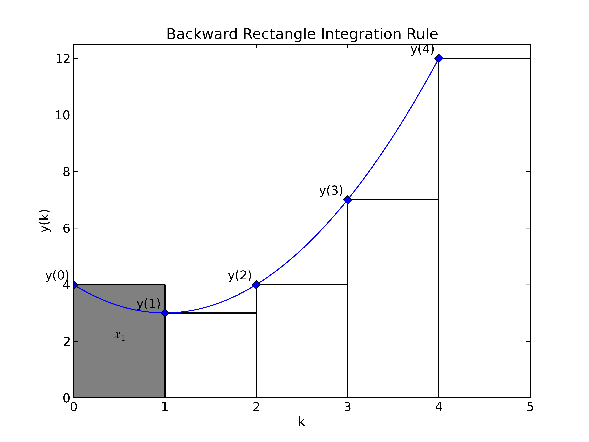

****************************
Introduction to Z-Transforms
****************************

.. contents::
    :depth: 3

In this module we will introduce the idea of a z-Transform.  For those of you who are familiar with Laplace transforms, the z-Transform can basically be seen as the discrete time equivalent of the Laplace transform.  The z-Transform will share many of the same properties as the Laplace transform.  For those of you who are not familiar with the Laplace transform then the information provided should be sufficient for your understanding.

The Z-Transform
===============

The z-transform is a transformation that moves us from the time domain to the frequency domain.  In the same fashion that it is possible to have both one and two-sided integral transforms the z-transform can also be one or two-sided.  However, for our purposes we will just consider the one-sided z-transform.

z-Transform (one sided)
	The z-transform of a sampled sequence :math:`x(kT)` or :math:`x(k)`, where :math:`k` represents non-negative integers and :math:`T` is the sampling period, is defined by the following equation. Note that the complex variable :math:`z` must be selected so that the summation converges [#fmain1]_ :

    .. math::
        :label: eq_ZTdef

        X(z) = \mathcal{Z}[x^*(t)] = \mathcal{Z}[x(kT)] = \mathcal{Z}[x(k)] = \sum_{k=0}^\infty x(kT)z^{-k} = \sum_{k=0}^\infty x(k) z^{-k}

Lets practice calculating the z-transform before we discuss how it can be used.

First Example
^^^^^^^^^^^^^

Consider the unit step function defined by:

.. math::

    u(k) = \begin{cases} 1 & \text{if } k>0 \\ 0 & \text{else} \end{cases}

We calculate the z-transform by using the definition.

.. math::

    X(z) = \mathcal{Z}[x(k)] &= \sum_{k=0}^\infty 1 z^{-k}

    &= 1 + z^{-1} + z^{-2} + ...

    &= \frac{1}{1 - z^{-1}}

    &= \frac{z}{z-1}

This z-transform is defined on :math:`|z|>1`.

Second Example
^^^^^^^^^^^^^^

Consider the polynomial function defined by:

.. math::

    u(k) = \begin{cases} a^k & \text{if } k \geq 0 \\ 0 & \text{if } k < 0 \end{cases}

We calculate the z-transform by using the definition.

.. math::

        X(z) = \mathcal{Z}[x(k)] &= \sum_{k=0}^\infty a^k z^{-k} \\
        &= \sum_{k=0}^\infty (a^{-1} z)^{-k}\\
        &= \frac{1}{1 - (a^{-1}z)^{-1}} \\
        &= \frac{z}{z-a}

This z-transform is defined on :math:`|z|>a`.

On Your Own
^^^^^^^^^^^

Now try to calculate the z-transform of the function:

.. math::

    u(k) = \begin{cases} \sin( \omega k T) & \text{if } k \geq 0 \\ 0 & \text{if } k < 0 \end{cases}

For what values of :math:`z` is it defined?

.. hint::

    Try writing it in terms of the definition of sin.  :math:`sin(x) = \frac{e^{ix} - e^{-ix}}{2i}`.

.. include:: transform_table.rst

The Inverse Z-Transform
=======================

Given a z-transform :math:`X(z)`, it might be useful to be able to convert from the z-transform back to the time sequence that corresponds with the z-transform.  This is where the inverse z-transform comes in; it moves you from the frequency domain back to the time domain.

inverse z-transform
    The inverse z-transform is defined as: :math:`x(k) = \mathcal{Z}^{-1}[X(z)] = \frac{1}{2 \pi i} \oint_C X(z) z^{k-1} \partial z` where the countour integration can be evaluated using the Caucy Residue Theorem.  The integration contour should enclose all singularities of :math:`X(z)`.

Considering the complicated form of the inverse z-transform, one might hope for easier ways to calculate the inverse z-transform than using the definition.  Luckily, there exist other methods of calculatig the inverse z-transform.  We will briefly examine a technique where we decompose the function into a combination of functions found on the table and then can look up the corresponding inverse z-transform functions.

Steps:

1.  Break up the function through partial fraction expansion of :math:`G[z] = \frac{F[z]}{z}` (This will help us get a constant term that we need).
2.  Multiply by :math:`z` to get back to :math:`F[z]`.
3.  Put each piece into a recognizable form.
4.  Transform each piece.

We will do a quick example of how to solve by inspection using the table above.

First Example
^^^^^^^^^^^^^
Find the inverse z-transform of the function :math:`X[z] = \frac{8z - 19}{(z-2)(z-3)z}`.

First we use partial fraction expansion to get :math:`G[z] = \frac{X[z]}{z} = \frac{c_1}{(z-2)} + \frac{c_2}{(z-3)} + \frac{c_3}{z}`.

Then we calculate the constants :math:`c_1, c_2, c_3` and get :math:`G[z] = \frac{(-19/6)}{z} + \frac{(3/2)}{(z-2)} + \frac{(5/3)}{(z-3)}`.

We then multiply by :math:`z` to get :math:`X[z] = \frac{-19}{6} + \frac{(3/2)z}{(z-2)} + \frac{(5/3)z}{(z-3)}`.

We can read each piece off of the table to get the inverse z-transform of each piece to get :math:`x[k]`

.. math::

    \frac{-19}{6} \rightarrow \frac{-19}{6} \delta[k]

    \frac{(3/2)z}{(z-2)} \rightarrow \frac{3}{2} (2)^k u[k]

    \frac{(5/3)z}{(z-3)} \rightarrow \frac{5}{3} (3)^k u[k]

This gives us that :math:`x[k] = \frac{-19}{6} \delta[k] + (\frac{3}{2} (2)^k + \frac{5}{3} (3)^k) u[k]`

Now that the basics of a z-transform have been presented we can move onto how to use them.

.. include:: properties.rst

Simple Example of a Difference Equation
=======================================

As a simple example of a difference equation we will examine the backward rectangle approximation of an integral.  Let :math:`x(k)` be the value of the integral at point :math:`k` and similarly :math:`x(k-1)` is the value at point :math:`k-1` etc...  Let the value of the function at point :math:`k` be given as :math:`y(k)`.  Then the value of the backward rectangle approximation at point :math:`k` can be expressed as:

.. math::

    x_(k) = x(k-1) + T y(k-1)

Although backward substitution and simple algebra could solve this particular problem [#fmain2]_, but this approach will not solve all linear difference equations.  We will now examine how z-transforms can be used to solve linear difference equations.  This method will require the use of the time-shift properties mentioned above.

The first step to solving a simple linear difference equation with z-transforms is to take the z-transform.  Then you should combine elements (time-shift properties allow everything to be expressed in :math:`X(z)`) and leave the equation in the form :math:`X(z)`.  We can then take the inverse z-transform of :math:`X(z)` to get

.. include:: pv.rst

..  [#fmain1] Note that some people use \sum_{k=0}^\infty x(k) z^{k}`.  We will use the definition given, but if you were working with the other definition all of this material can be easily translated by converting all of the :math:`z`'s to :math:`\frac{1}{z}`.
.. [#fmain2] Doing this obtains the equation :math:`x(k) = x(0) + T \sum_{j=0}^{k-1} y(j)`.
